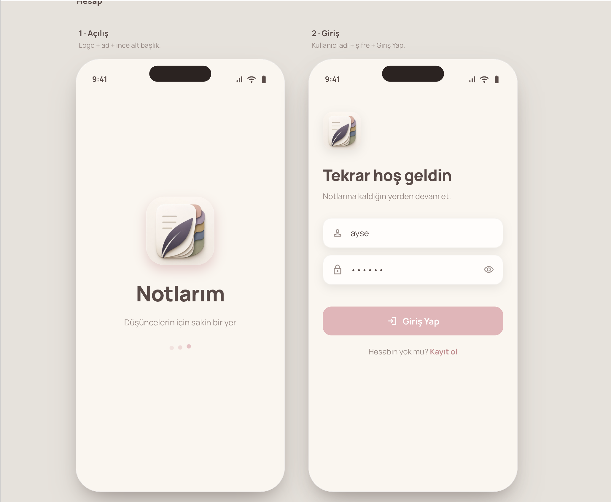
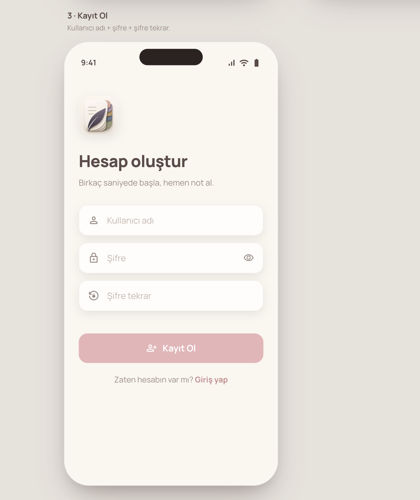
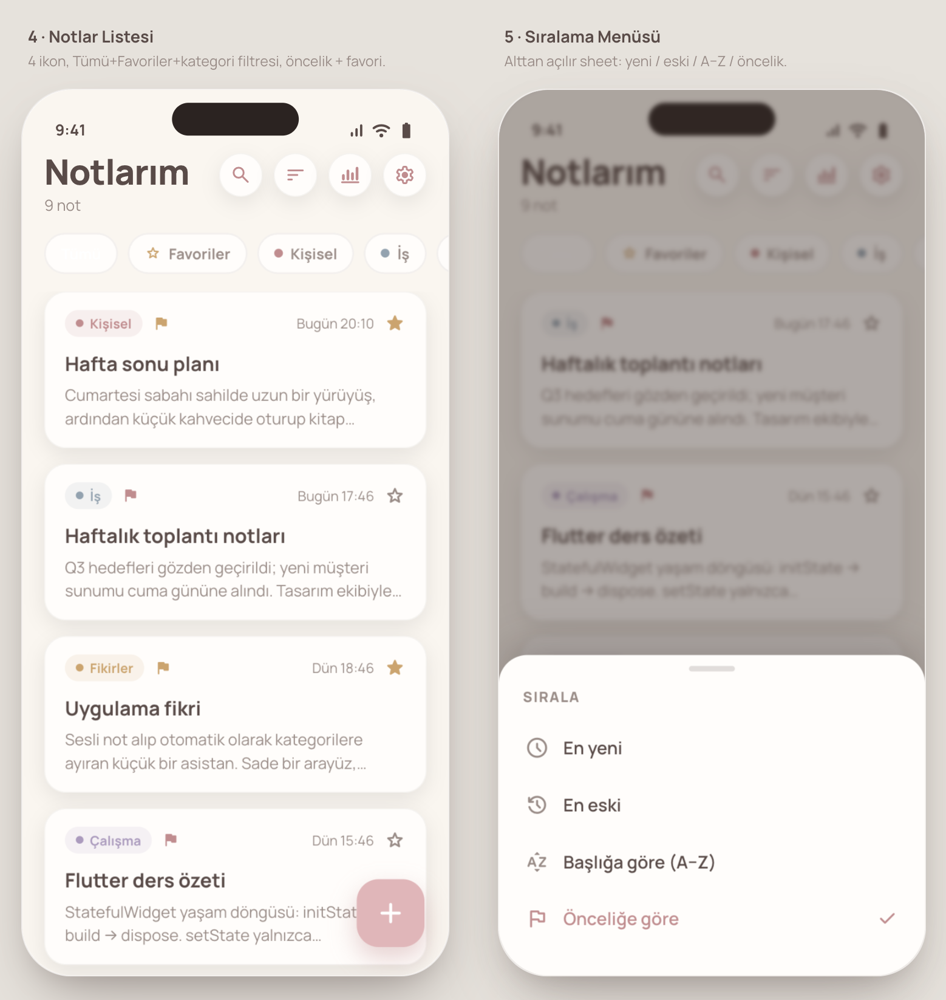
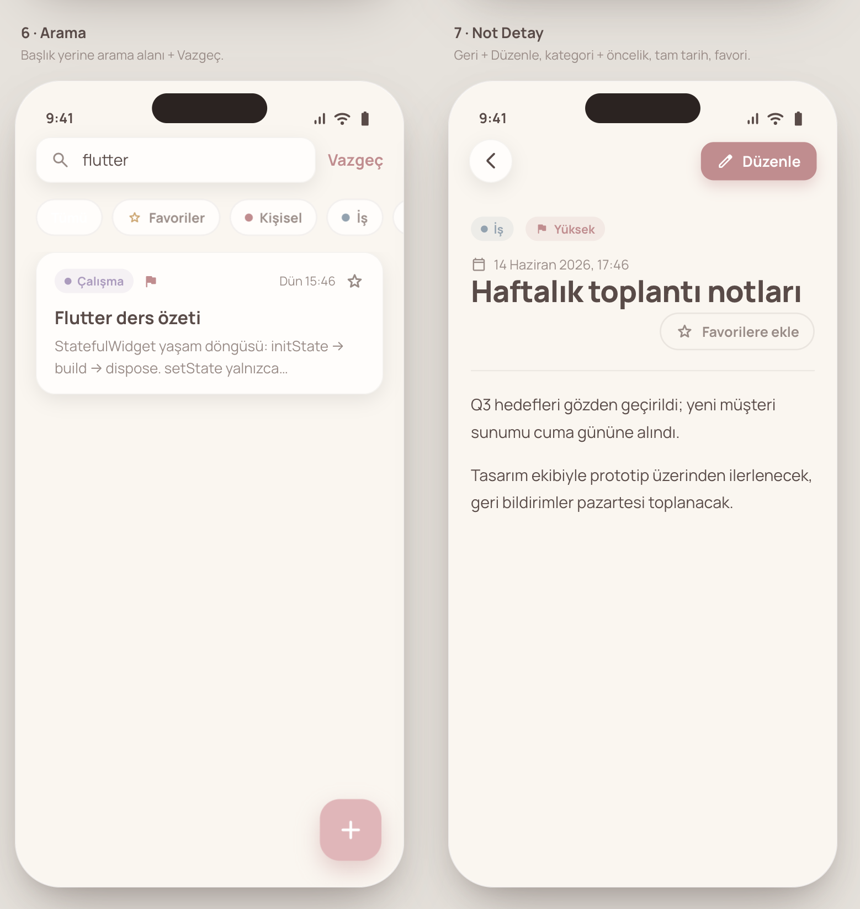
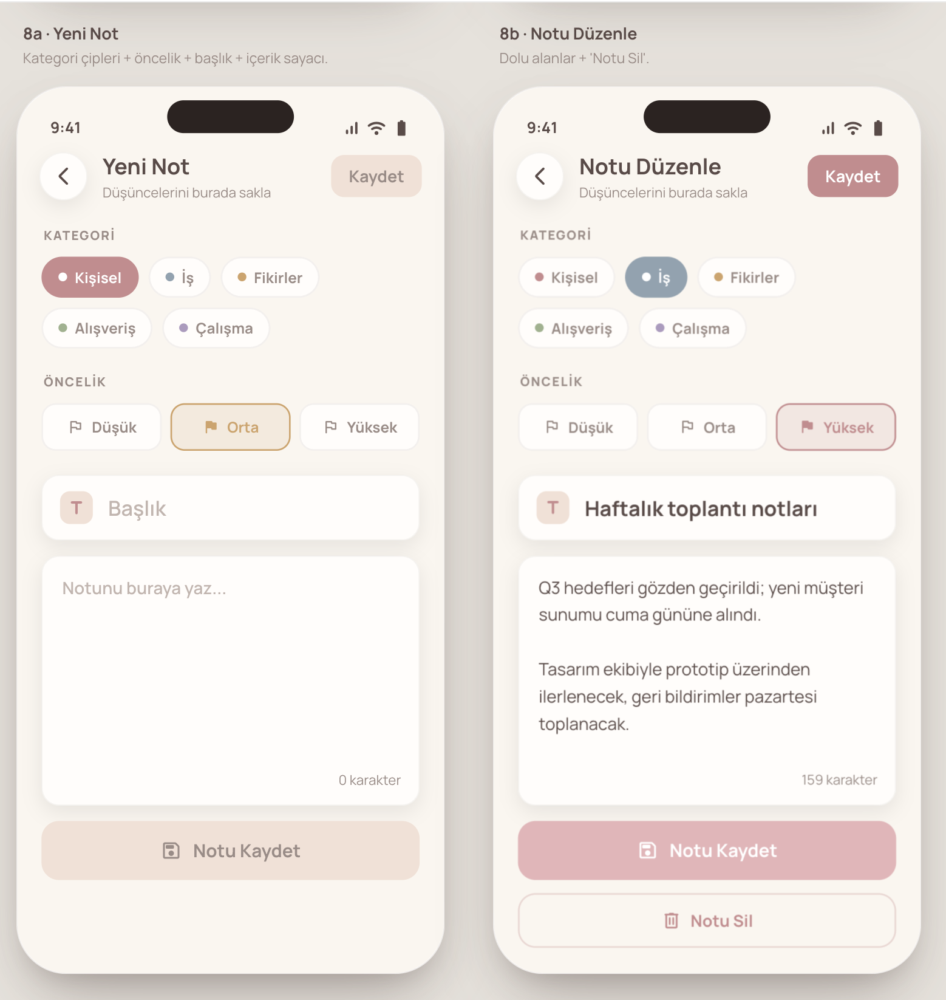
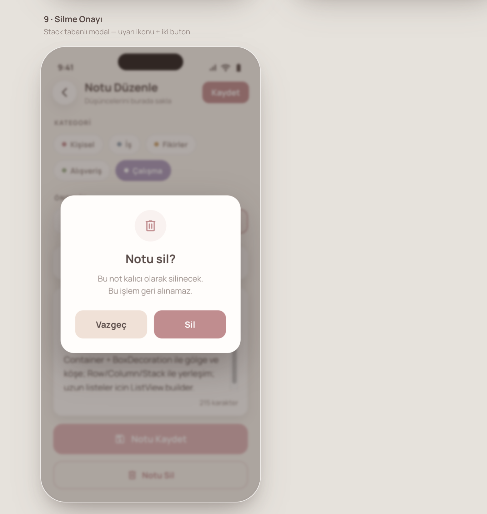
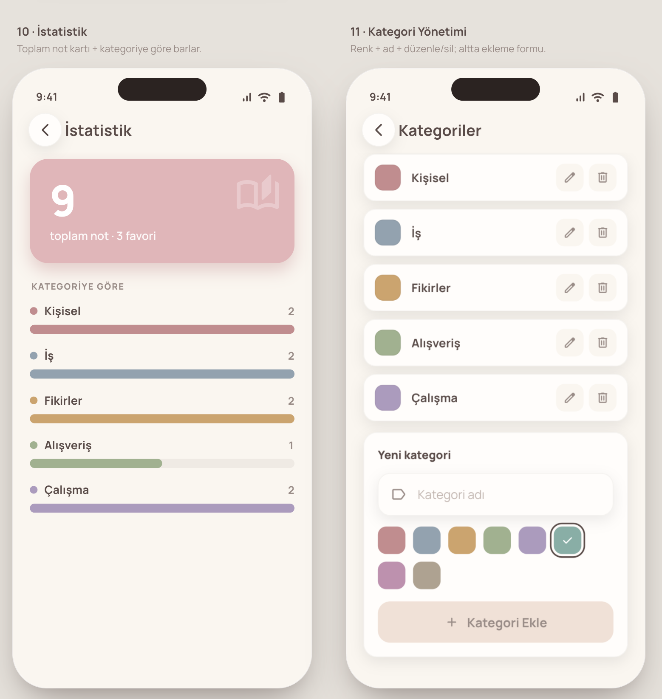
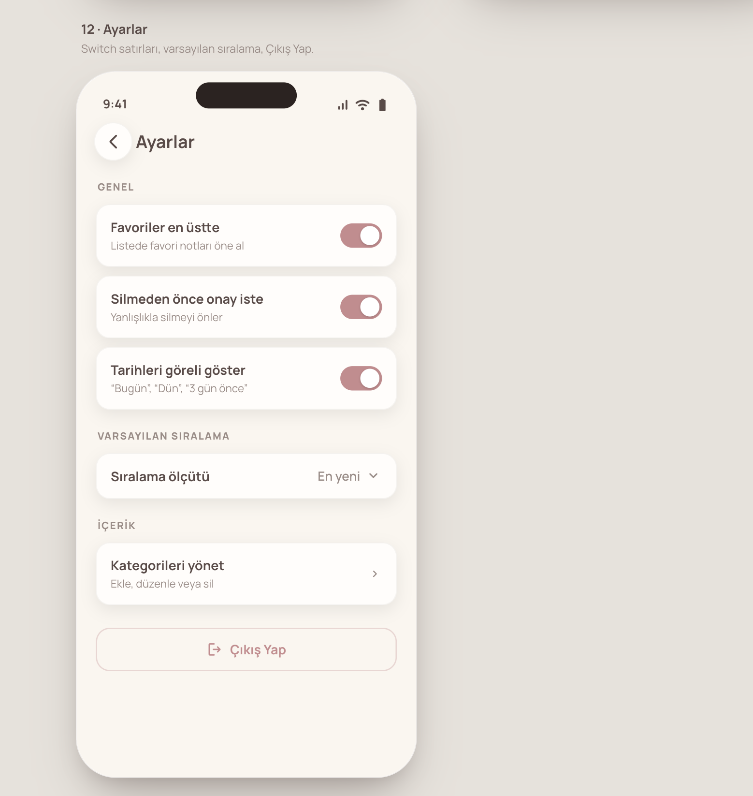
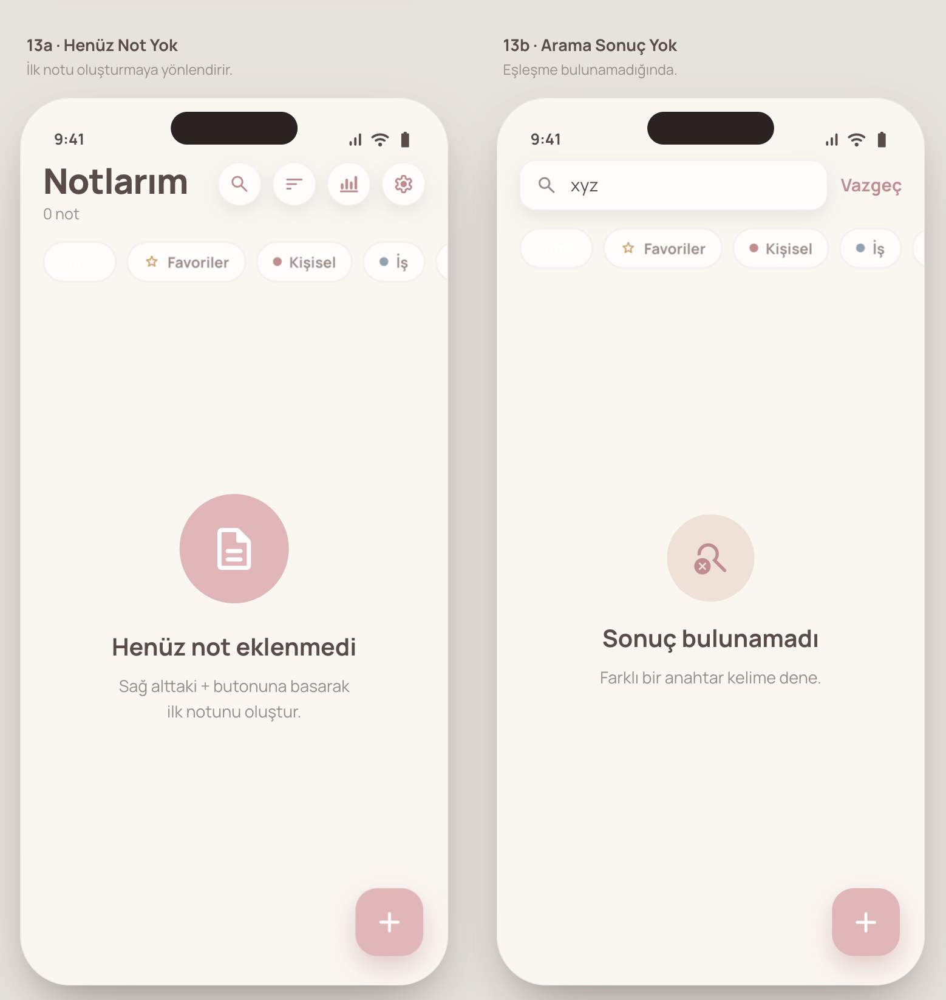
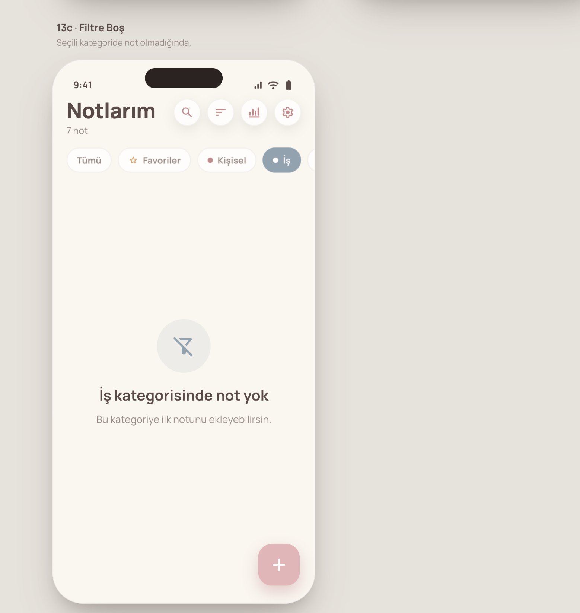

# Notes

Flutter + SQLite ile geliştirilmiş çok kullanıcılı not yönetimi uygulaması. Her kullanıcı kendi hesabıyla giriş yaparak notlarını oluşturur, düzenler ve kategori, öncelik, favori ve arama özellikleriyle organize eder; ayrıca kişisel istatistiklerini görüntüler. Uygulama; katmanlı DAO mimarisi, ilişkisel bir SQLite şeması (yabancı anahtar korumalı) ve özelleştirilmiş widget'lar üzerine kuruludur.

---

## Ekran Görüntüleri

| | |
|:---:|:---:|
|  |  |
| **Açılış ekranı · Giriş** | **Hesap oluştur** |
|  |  |
| **Notlar listesi · Sıralama menüsü** | **Arama · Not detay** |
|  |  |
| **Yeni not · Notu düzenle** | **Silme onayı** |
|  |  |
| **İstatistik · Kategori yönetimi** | **Ayarlar** |
|  |  |
| **Henüz not yok · Sonuç bulunamadı** | **Filtre boş durumu** |

---

## Özellikler

- Kullanıcı kaydı ve giriş (SQLite kayıt kontrol)
- Not oluşturma, düzenleme, silme (CRUD)
- Favori işaretleme (yıldız)
- Öncelik seviyeleri: Düşük · Orta · Yüksek
- Kategori bazlı filtreleme ve metin araması
- Dört sıralama modu (En Yeni · En Eski · A–Z · Önceliğe Göre)
- Kategori yönetimi: ekle, düzenle, sil (FOREIGN KEY koruması)
- Kullanıcı başına ayarlar: "Favoriler en üste" ve varsayılan sıralama
- İstatistik ekranı: toplam not sayısı + kategori dağılımı (bar grafik)
- Açılış (splash) ekranı

---

## Teknik Öne Çıkanlar

| Özellik | Teknik Kavram |
|---------|---------------|
| `Not extends Kayit` | Kalıtım (`abstract class`, `extends`, `super`) |
| `Kullanici`, `Not`, `Kategori`, `Ayar` model sınıfları | Nesne Tabanlı Programlama, `factory constructor`, `const` |
| `NotDao`, `KategoriDao`, `KullaniciDao`, `AyarDao` | DAO deseni, `Future`, `async/await` |
| SQLite veritabanı (4 tablo, PK, FK) | `sqflite`, `CREATE TABLE`, `FOREIGN KEY`, `PRAGMA foreign_keys = ON` |
| DB versiyon yükseltme (`onUpgrade`) | `ALTER TABLE`, `DROP TABLE IF EXISTS` |
| `StatefulWidget` + `setState` | Durum yönetimi |
| `Navigator.push` / `pop` / `pushReplacement` / `pushAndRemoveUntil` | Sayfa yönlendirme |
| Constructor ile veri taşıma (`kullanici`, `kategoriler`) | Sayfalar arası veri transferi |
| `switch` ile sıralama modu | `switch` ifadesi |
| `for` ile kategori döngüsü | `for` döngüsü |
| `COUNT(*)`, `LIKE`, `ORDER BY` | SQL sorguları |
| `Stack + Positioned.fill` overlay | Layout widget'ları |
| `ElevatedButton`, `Switch`, `DropdownButton`, `TextField`, `TextFormField` | Etkileşimli widget'lar |
| `GestureDetector`, `Container + BoxDecoration` | Özel widget yapımı |
| `MediaQuery` ile oranlama | Responsive tasarım |
| `NotKarti`, `FiltreCipi`, `KategoriEtiket`, `BosDurum` | Özelleştirilmiş (custom) widget |
| `Future.delayed` (açılış ekranı) | Asenkron programlama |
| `SnackBar` ile hata gösterimi | Kullanıcı bilgilendirme |

---

## Veritabanı Şeması

```
┌─────────────────────────────────────────────────────────────┐
│ kullanicilar                                                │
│  kullanici_id  INTEGER  PK AUTOINCREMENT                    │
│  kullanici_adi TEXT     NOT NULL UNIQUE                     │
│  sifre         TEXT     NOT NULL                            │
└───────────────────────┬─────────────────────────────────────┘
                        │ 1:N
         ┌──────────────┴───────────────────┐
         ▼                                  ▼
┌─────────────────────┐          ┌──────────────────────────┐
│ notlar              │          │ ayarlar                  │
│  not_id        PK   │          │  kullanici_id   PK FK    │
│  baslik             │          │  favori_ustte   INTEGER  │
│  icerik             │          │  varsayilan_    INTEGER  │
│  kategori_id   FK ──┤──┐       │  siralama                │
│  kullanici_id  FK   │  │       └──────────────────────────┘
│  favori             │  │
│  oncelik            │  │
│  olusturma_tarihi   │  │
└─────────────────────┘  │
                         │ N:1
              ┌──────────┘
              ▼
┌─────────────────────┐
│ kategoriler         │
│  kategori_id   PK   │
│  kategori_ad   TEXT │
│  renk          INT  │
└─────────────────────┘
```

---

## Klasör Yapısı

```
lib/
├── database/
│   ├── db_helper.dart        # Singleton SQLite bağlantısı, şema, seed
│   ├── kullanici_dao.dart    # Giriş doğrulama, kayıt
│   ├── not_dao.dart          # Not CRUD + arama + istatistik
│   ├── kategori_dao.dart     # Kategori CRUD (ekle/düzenle/sil)
│   └── ayar_dao.dart         # Kullanıcı ayarları
├── models/
│   ├── kayit.dart            # Abstract temel sınıf (id, tarih)
│   ├── not.dart              # Not extends Kayit
│   ├── kategori.dart         # Kategori modeli
│   ├── kullanici.dart        # Kullanıcı modeli
│   └── ayar.dart             # Ayar modeli
├── screens/
│   ├── acilis_ekrani.dart    # Splash ekranı
│   ├── giris_ekrani.dart     # Kullanıcı girişi
│   ├── kayit_ekrani.dart     # Yeni kullanıcı kaydı
│   ├── notlar_ekrani.dart    # Ana liste + filtre + arama
│   ├── not_duzenle_ekrani.dart
│   ├── not_detay_ekrani.dart
│   ├── istatistik_ekrani.dart
│   ├── ayarlar_ekrani.dart
│   └── kategori_yonetimi_ekrani.dart
├── widgets/
│   ├── not_karti.dart        # Özel kart widget'ı
│   ├── filtre_cipi.dart      # Kategori filtre çipi
│   ├── kategori_etiket.dart  # Renkli kategori rozeti
│   └── bos_durum.dart        # Boş liste durumu
├── theme/
│   └── renkler.dart          # Renk sabitleri
└── main.dart
```

---

## Kurulum

```bash
# Depoyu klonla
git clone https://github.com/sevimakpinareng/notes.git
cd notes

# Bağımlılıkları yükle
flutter pub get

# iOS simülatöründe çalıştır
flutter run

# Analiz
flutter analyze
```

**Gereksinimler:** Flutter 3.x · Dart 3.x · iOS Simülatörü veya Android Emülatörü

---

## Demo Giriş

Uygulama ilk açıldığında hazır bir demo hesabıyla giriş yapabilir veya kayıt ekranından kendi hesabınızı oluşturabilirsiniz.

> **Güvenlik notu:** Bu sürümde şifreler basitlik adına düz metin olarak saklanmaktadır. Üretim ortamında bcrypt gibi bir hash algoritması kullanılması önerilir.

---

## Lisans

[MIT](LICENSE) © 2026 Sevim Akpınar
